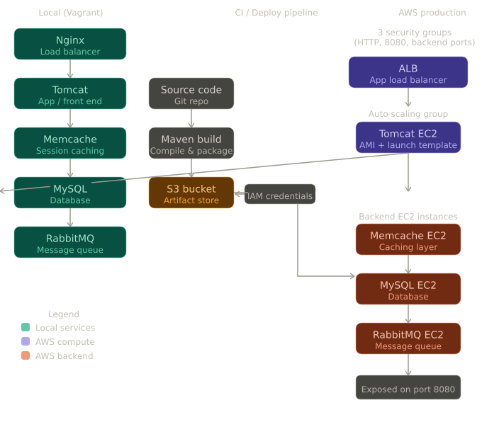
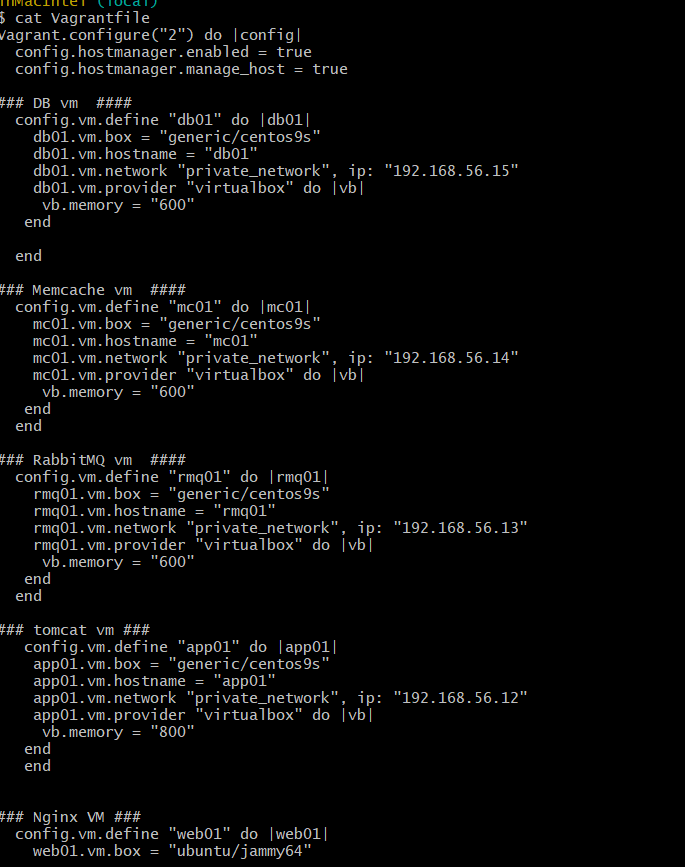
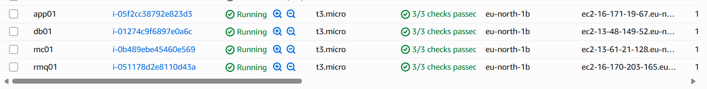

# Lift & Shift — VProfile App on AWS

Migrating a multi-tier Java web application from a local Vagrant 
environment to AWS using EC2, ALB, Auto Scaling, S3, and IAM.

## Architecture

## Tech stack

| Layer          | Local (Vagrant) | AWS              |
|----------------|-----------------|------------------|
| Load balancer  | Nginx           | Application LB   |
| App server     | Tomcat          | Tomcat on EC2    |
| Caching        | Memcache        | Memcache EC2     |
| Database       | MySQL           | MySQL EC2        |
| Messaging      | RabbitMQ        | RabbitMQ EC2     |
| Build tool     | Maven           | Maven            |
| Artifact store | —               | S3 bucket        |

## Phase 1 — Local setup with Vagrant

- Provisioned 5 VMs using Vagrant
- Nginx configured as load balancer, forwarding to Tomcat
- Tomcat serves the Java web app
- Memcache, MySQL, and RabbitMQ set up as backend services

## Phase 2 — AWS deployment

### Security groups
Created 3 security groups:
- **ALB SG** — inbound HTTP (port 80)
- **Tomcat SG** — inbound port 8080 from ALB SG
- **Backend SG** — inbound port 3306 (MySQL), 11211 (Memcache), 
  5672 (RabbitMQ) from Tomcat SG

### Artifact deployment
1. Built `.war` artifact using Maven from source
2. Uploaded artifact to S3 bucket using IAM user credentials
3. Tomcat EC2 pulls artifact from S3 on launch

### Load balancer
- Application Load Balancer configured to forward to Tomcat on port 8080

### Auto scaling
- Created AMI from configured Tomcat instance
- Launch template referencing the AMI
- Auto Scaling Group attached to the ALB

## Screenshots

| Local setup | AWS console |
|---|---|
|  |  |
